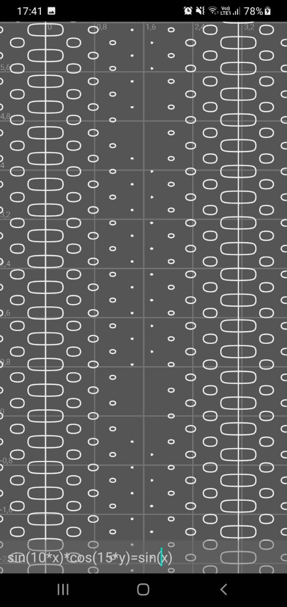
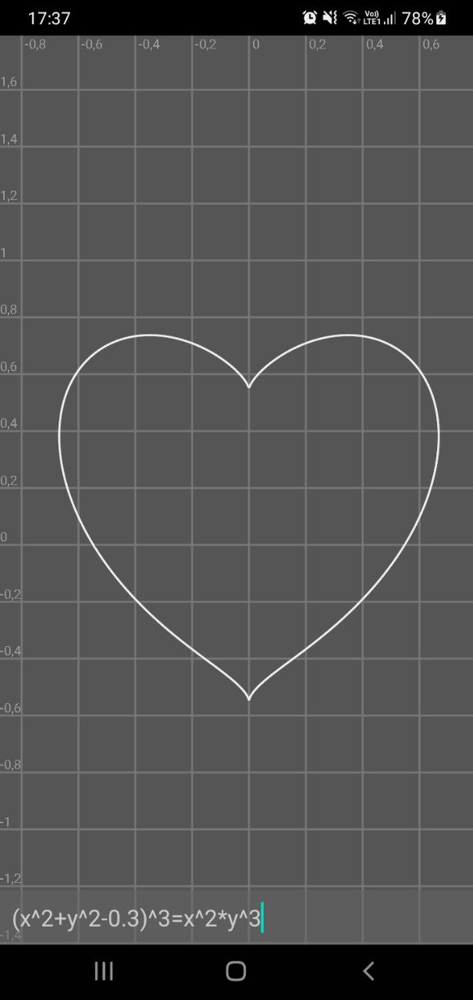

# Implicit

Kind of a Desmos clone for Android. You can input any implicit equation and it will generate 2D plot for you.
For this marching squares algorithm was used. Also for evaluation of equations and derivatives modified Dijkstra algorithm is used.

#### TO DO:

- Solve problem with $\sin(\frac{1}{x})$ and calculating the curve around 0
- Add custom keyboard layout
